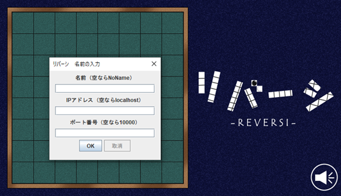
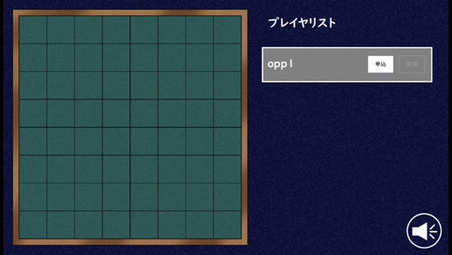
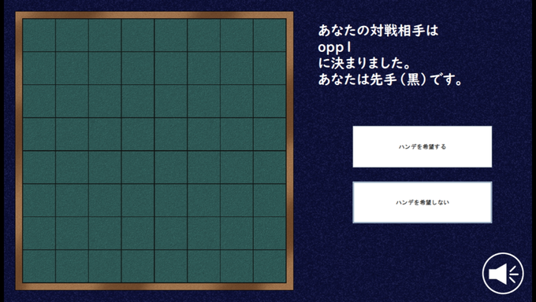
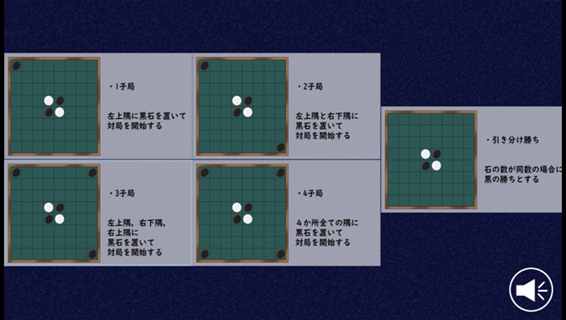
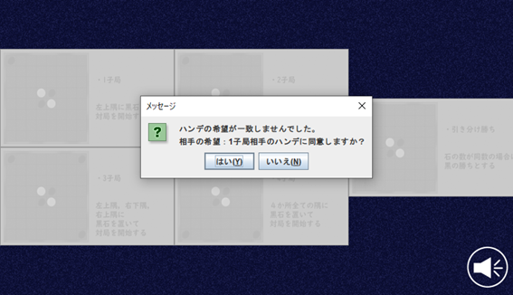
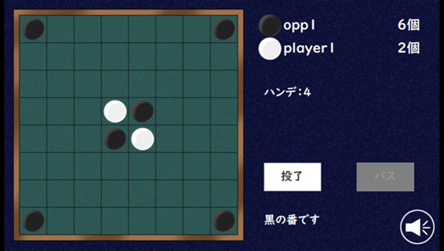
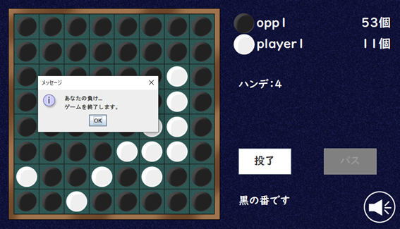

# Online Othello game realised in java

* ネットワークを介してオセロ対局を実現
* 対戦相手と折衝をし，片方のプレイヤの石が多い状態で開始するハンディキャップを付加することが可能

## 制作時期
2021年4月~5月

## 動作条件
JRE	v.15

## 実際の画像
プレイヤ名入力： 

 
マッチング画面： 

 
ハンデ選択： 

 
ハンデ折衷： 

 
プレイ中： 

 
ゲーム終了： 

